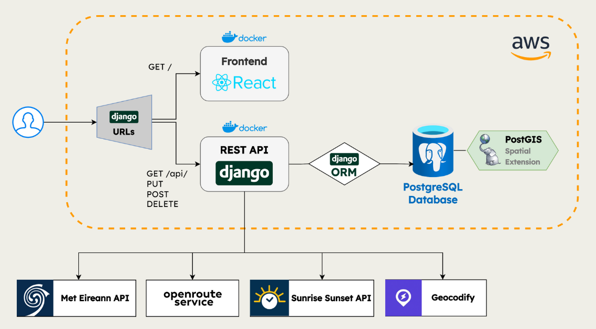

      

# Overview

This app brings together features from several weather forecasting, recreation, and map navigation products. It allows users to search for locations on a map, ask about the weather, and explore various recreational activities all across Ireland, as well as get directions to a location. The app visualises trails on the map and displays weather forecast at various time milestones calculated dynamically based on trail data.

**Figure 1:** System Architecture Diagram

# Features

## 📍 Location

The user can set their location:
- Textually
  - At a city
  - At a landmark
- Manually
  - setting latitude and longitude
- Automatically
  - Using GPS location

Users can also save a default location, and fetch it to avoid having to set it every time.

## 🌦️ Weather and Trails

### 🌩️ Weather

#### Alerts

National Met Éireann weather alerts are displayed at the top of the screen. Users can create their own alerts.

#### Forecast

Users can see the weather forecast for their location for the next 24 hours.

### 🥾 Trails

#### Preferences

Users can choose to only see trails that suit their preferences.

#### Display

A map shows the routes of the five closest cycling and walking trails to the user's current location. 

#### Data

Users are shown an indicator which assesses the weather on the selected trails, and includes the weather as forecast on the trail.

Users can set an a trail to their favourites, and set it as their destination

## 🧭 Directions

Once a trail is selected, users can get directions to their chosen route. Textual directions are given, as well as an estimated travel time.

## 🌤️ Weather comparisons

For groups of friends (or families!) living in different parts of Ireland, the weather comparisons allows them to see which location has the better weather, so they can look for nearby trails to it.

# Step by Step

## Run Production (recommended)

To access the deployed app, simply navigate to the link below:

### https://groupdesign10.shor.ink/

## Run Locally

If you would like to run the app locally instead, follow the instructions below.

Disclaimer: To access our database and external APIs, please request a .env file from us.

### Build
First time or anytime Dockerfiles and docker-compose.yml change:

`docker-compose --profile dev up --build`

### Run
Every other time do:

`docker-compose --profile dev up --build`

And to close the containers:

`docker-compose --profile dev down -v`

### Running Migrations

Every time there are changes to the database models.

For example, to make new migrations for the Django app `api`:

``docker exec weather_backend python manage.py makemigrations api``

And migrate:

``docker exec weather_backend python manage.py migrate api``

### Run Django Commands

You can also run Django python commands directly in each container without needing to use `docker exec ...` by opening an interactive shell session:

`docker exec -it weather_backend /bin/bash`

And within that for example you can do directly:

`python manage.py migrate`

# Backends

You can check the status of our production server, database, and Docker containers at the following endpoint:

### http://139.162.215.133:5920/stats
